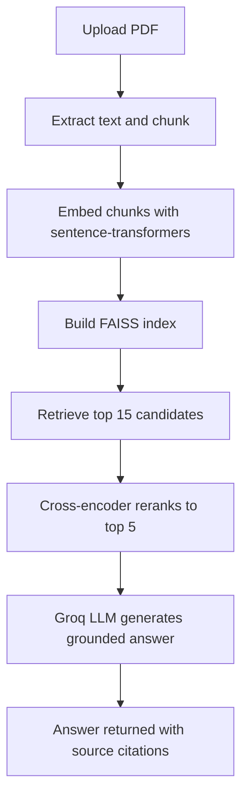

# Document RAG System

An intelligent document Q&A API: upload a PDF, ask natural-language questions, and get grounded, cited answers — built on a two-stage retrieve-and-rerank pipeline rather than plain vector search.


**[Live demo](#)** — replace with your deployed URL once live

<!-- Add a screenshot here once you have one:  -->

## The problem

Reading through long PDFs to find a specific answer is slow. This system lets you upload any document and just ask — the answer comes back grounded in the actual document content, not a generic LLM guess.

## Why retrieve-and-rerank, not just vector search

Most basic RAG tutorials stop at "embed the query, grab the top-k FAISS matches." That works, but vector similarity alone sometimes ranks a chunk that's *topically* close over one that's *actually* the best answer. This system adds a second stage: FAISS casts a wide net (15 candidates), then a cross-encoder — which reads the question and each chunk together, rather than comparing pre-computed embeddings — rescores them and keeps the best 5. It's slower per-query, but meaningfully more accurate.



## Features

- Upload any PDF, auto-detects document type (Resume, Research Paper, Academic, General)
- Two-stage retrieval: FAISS + cross-encoder reranking for higher-precision answers
- Session-based conversation memory — ask natural follow-up questions
- Every answer traceable back to the specific chunks it was grounded in
- Clean web interface (upload, chat, summarize) — no separate frontend needed
- Fully containerized, CI/CD-ready for cloud deployment

## Tech stack

| Layer | Choice |
|---|---|
| API | FastAPI |
| Embeddings | sentence-transformers (`all-MiniLM-L6-v2`) |
| Vector search | FAISS |
| Reranking | Cross-encoder (`ms-marco-MiniLM-L-6-v2`) |
| LLM | Groq (`llama-3.1-8b-instant`) |
| Frontend | Vanilla HTML/CSS/JS, served by FastAPI |
| Deployment | Docker, GitHub Actions CI/CD |

## Quick start

```bash
pip install -r requirements.txt
export GROQ_API_KEY=your_key_here   # free at console.groq.com/keys
uvicorn app.main:app --reload
```

Visit `http://localhost:8000` for the interface, or `http://localhost:8000/docs` for the interactive API docs.

## Running with Docker

```bash
docker build -t document-rag-system .
docker run -p 8080:8080 -e GROQ_API_KEY=your_key_here document-rag-system
```

## API reference

| Method | Endpoint | Description |
|---|---|---|
| `GET` | `/health` | Health check |
| `POST` | `/upload/{session_id}` | Upload a PDF for a session |
| `POST` | `/ask/{session_id}` | Ask a question about the document |
| `POST` | `/summarize/{session_id}` | Get a document summary |
| `GET` | `/history/{session_id}` | View conversation history |

## Known limitations

- Session state is in-memory — resets on restart. A production version would use Redis for shared state across instances.
- Chunking uses a fixed-size sliding window; semantic/paragraph-aware chunking is a natural next improvement.

See `DEPLOYMENT.md` for cloud deployment instructions.
